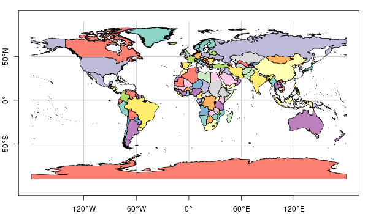

```{r setup, include=FALSE}
knitr::opts_chunk$set(echo = TRUE)
```

--------


https://twitter.com/mikarantane/status/1324286992071446529


--------

```{r echo=FALSE,fig.width=10}
suppressPackageStartupMessages(library(sf))
library(rnaturalearth)
co = ne_countries(returnclass = "sf")
plot(co["name_sort"], axes = TRUE, graticule = TRUE, col_graticule = 'orange', 
  main="Natural Earth countries 1:110, WGS 84 plotted as Plate Carree")
```

--------


```{r echo=FALSE,fig.width=10}
par(mfrow = c(1, 2))
fi = co[co$name_sort == "Fiji",] %>% 
	st_geometry() %>% 
	st_transform('EPSG:3143')
plot(fi[1], graticule=TRUE, axes=TRUE, col_graticule='orange', 
  main = 'Fiji 1986 / Fiji Map Grid')
a = co[co$name_sort == "Antarctica",] %>% 
	st_geometry() %>% 
	st_transform('EPSG:3031')
plot(a[1], graticule=TRUE, axes=TRUE, col_graticule='orange', 
  main = 'Antarctic Polar Stereographic')
```

## What is spherical geometry?
Earth-related coordinates of spatial data can be either

- _projected_: measured on a two-dimensional surface, which is associated with a projection from the Earth's **surface**
- _geocentric_: x-, y-, and z-coordinates associated with the three principal directions, measured from Earth's **center**
- _geographic_: degrees latitude and longitude, associated with a datum (ellipsoidal or even spherical model of the Earth)

------

```{r echo=FALSE,fig.width=10}
e = cbind(-90:90,0) # equator
f1 = rbind(cbind(0, -90:90)) # 0/antimerid.
f2 = rbind(cbind(90, -90:90), cbind(270, 90:-90))# +/- 90
eq = st_sfc(st_linestring(e), st_linestring(f1), st_linestring(f2), crs=4326)

geoc = st_transform(eq, "+proj=geocent")
cc = rbind(geoc[[1]], NA, geoc[[2]], NA, geoc[[3]])
from3d = function(x, offset, maxz, minz) {
	x = x[,c(2,3,1)] + offset # move to y right, x up, z backw
	x[,2] = x[,2] - maxz      # shift y to left
	d = maxz
	z = x[,3] - minz + offset
	x[,1] = x[,1] * (d/z)
	x[,2] = x[,2] * (d/z)
	x[,1:2]
}
maxz = max(cc[,3], na.rm = TRUE)
minz = min(cc[,3], na.rm = TRUE)
offset = 3e7
circ = from3d(cc, offset, maxz, minz)
mx = max(cc, na.rm = TRUE) * 1.1
x = rbind(c(0, 0, 0), c(mx, 0, 0))
y = rbind(c(0, 0, 0), c(0, mx, 0))
z = rbind(c(0, 0, 0), c(0, 0, mx))
ll = rbind(x, NA, y, NA, z)
l0 =  from3d(ll, offset, maxz, minz)
mx = max(cc, na.rm = TRUE) * 1.2
x = rbind(c(0, 0, 0), c(mx, 0, 0))
y = rbind(c(0, 0, 0), c(0, mx, 0))
z = rbind(c(0, 0, 0), c(0, 0, mx))
ll = rbind(x, NA, y, NA, z)
l =  from3d(ll, offset, maxz, minz)

par(mfrow = c(1, 2))
par(mar=rep(c(0,0,1,0)))
plot.new()
plot.window(xlim = c(min(circ[,1],na.rm = TRUE), 3607103*1.02),
						ylim = c(min(circ[,2],na.rm = TRUE), 2873898*1.1), asp = 1)
lines(circ)
lines(l0)
text(l[c(2,5,8),], labels = c("x", "y", "z"), col = 'red')
# add POINT(60 47)
p = st_as_sfc("POINT(60 47)", crs = 4326) %>% st_transform("+proj=geocent")
p = p[[1]]
pts = rbind(c(0,0,0), c(p[1],0,0), c(p[1],p[2],0), c(p[1],p[2],p[2]))
ptsl =  from3d(pts, offset, maxz, minz)
lines(ptsl, col = 'blue', lty = 2, lwd = 2)
points(ptsl[4,1], ptsl[4,2], col = 'blue', cex = 1, pch = 16)
title("geocentric coordinates")

plot.new()
plot.window(xlim = c(min(circ[,1],na.rm = TRUE), 3607103*1.02),
						ylim = c(min(circ[,2],na.rm = TRUE), 2873898*1.1), asp = 1)
lines(circ)
title("geographic coordinates")

p = st_as_sfc("POINT(60 47)", crs = 4326) %>% st_transform("+proj=geocent")
p = p[[1]]
pts = rbind(c(0,0,0), c(p[1],p[2],p[3]))
pt =  from3d(pts, offset, maxz, minz)
lines(pt)
points(pt[2,1], pt[2,2], col = 'blue', cex = 1, pch = 16)

p0 = st_as_sfc("POINT(60 0)", crs = 4326) %>% st_transform("+proj=geocent")
p0 = p0[[1]]
pts = rbind(c(0,0,0), c(p0[1],p0[2],p0[3]))
pt =  from3d(pts, offset, maxz, minz)
lines(pt)

p0 = st_as_sfc("POINT(0 0)", crs = 4326) %>% st_transform("+proj=geocent")
p0 = p0[[1]]
pts = rbind(c(0,0,0), c(p0[1],p0[2],p0[3]))
pt =  from3d(pts, offset, maxz, minz)
lines(pt)

p0 = st_as_sfc("POINT(0 90)", crs = 4326) %>% st_transform("+proj=geocent")
p0 = p0[[1]]
pts = rbind(c(0,0,0), c(p0[1],p0[2],p0[3]))
pt =  from3d(pts, offset, maxz, minz)
lines(pt, lty = 2)

p0 = st_as_sfc("POINT(90 0)", crs = 4326) %>% st_transform("+proj=geocent")
p0 = p0[[1]]
pts = rbind(c(0,0,0), c(p0[1],p0[2],p0[3]))
pt =  from3d(pts, offset, maxz, minz)
lines(pt, lty = 2)

f1 = rbind(cbind(0:60, 0))
arc = st_sfc(st_linestring(f1), crs=4326)
geoc = st_transform(arc, "+proj=geocent")
cc = rbind(geoc[[1]])
circ = from3d(cc, offset, maxz, minz)
lines(circ, col = 'red', lwd = 2, lty = 2)

f1 = rbind(cbind(60, 0:47))
arc = st_sfc(st_linestring(f1), crs=4326)
geoc = st_transform(arc, "+proj=geocent")
cc = rbind(geoc[[1]])
circ = from3d(cc, offset, maxz, minz)
lines(circ, col = 'blue', lwd = 2, lty = 2)

text(pt[1,1]+100000, pt[1,2]+50000, labels = expression(phi), col = 'blue') # lat
text(pt[1,1]+20000, pt[1,2]-50000, labels = expression(lambda), col = 'red') # lng
```

------

Geometric operations include computation of 

* **measures** (area, length/distance, direction, ...), 
* **predicates** (intersects, covers, contains, touches, ...) and 
* **transformations** (intersection, union, difference, symmetric difference, buffer)

Geometrical operations on projected or geocentric coordinates can be done using Euclidean geometry, where all lines are straight.

Spherical (or ellipsoidal) geometry operations are computed over the surface of the sphere (ellipsoid); lines connecting points are great circle arcs.

## Why is this worth talking about?

- I believe that applying Euclidian geometry to geographical coordinates is the number one most common error made in spatial data science (closely followed by ignoring the support of data).

- technological advances have made spherical geometry a good option, but inertia in legacy GIS, OGC, and data science software have slowed down its adoption / uptake

- We have gotten used to Plate Carree, and modified our datasets accordingly.

- Even GeoJSON has written down that the world is 2D -- [Clause 3.1.9. Antimeridian Cutting](https://datatracker.ietf.org/doc/html/rfc7946#section-3.1.9):

    * In representing Features that cross the antimeridian, interoperability is improved by modifying their geometry.  Any geometry that crosses the antimeridian SHOULD be represented by     cutting it in two such that neither part's representation crosses the antimeridian. 

------------

 https://xkcd.com/977/

------------


https://en.wikipedia.org/wiki/Equirectangular_projection

## What is (so bad about) Plate Carrée?

Compared to other projections:

* every global projection is miserable in its own way
* it preserves shape (1 unit easting equals 1 unit Northing) only at the equator
* it is hopeless at the poles and at the antimeridian

Compared to an ellipsoid, or sphere:

* It is 2D. The world is round, bro.

-----------

Consider, for a moment, the difference between:

* a flat projection of the sphere, and a sphere (1, 2)
* a sphere and an ellipsoid with 1/300 flattening (2, 3)

 
 
 

--------------

**Equirectangular projection**: where meridians and parallels form equal rectangles (left; shape preserving at center), not squares (right: nowhere true)

```{r world, echo=FALSE, fig.height=6}
suppressPackageStartupMessages(library(sp))
data(air, package = "spacetime")
DE <- st_as_sf(DE_NUTS1)
par(mfrow=c(1, 2))
plot(st_geometry(DE), graticule=TRUE,axes=TRUE, main="equirectangular")
plot(st_geometry(DE), graticule=TRUE,axes=TRUE,asp=1,main="plate carree")
```

------

 

## Prior work

* GeographicLib (C.F.F. Karney), "_[...] a small set of C++ classes for [...] solving geodesic problems._" 
    * https://geographiclib.sourceforge.io/ 
	* ellipsoidal, Taylor expansions exact up to 8-byte doubles
	* part of Proj.4, now PROJ
* PostGIS (liblwgeom)'s `geography` type
    * [funded by palantir](http://blog.cleverelephant.ca/2017/12/postgis-fund-me.html)
	* [feature list](https://postgis.net/workshops/postgis-intro/geography.html), 
	* cheats:  "_The buffer and intersection functions are actually wrappers on top of a cast to geometry, and are not carried out natively in spherical coordinates. As a result, they may fail to return correct results for objects with very large extents that cannot be cleanly converted to a planar representation._"

--------

* R package `geosphere` providing distance, bearing, etc, and several alternative measures
* R packages `sp`, `gstat`, `spdep` using geodetic distances in case of geographic coordinates
* R package `lwgeom` interfacing parts of `liblwgeom`

Modern solutions, open source libraries:

* Google's [s2geometry](https://s2geometry.io) (C++, Java, Go, Python)
* [H3](https://eng.uber.com/h3/): Uber’s Hexagonal Hierarchical Spatial Index

## The situation with `sf` and `stars`

```{r echo=FALSE}
suppressPackageStartupMessages(library(units))
```

```{r}
st_as_sfc("POLYGON((0 0,1 0,1 1,0 1,0 0))") %>% 
	st_area()
st_as_sfc("POLYGON((0 0,1 0,1 1,0 1,0 0))", crs = "EPSG:4326") %>% 
	st_area() %>%
	set_units(km^2)
```

$\Rightarrow$ measures are computed over the sphere/ellipsoid

-------

```{r}
sf_use_s2(FALSE)
a <- st_as_sfc("POINT(7 53)", crs = "EPSG:4326") %>% 
	st_buffer(set_units(1, degree)) %>%
	st_transform("EPSG:25832") # UTM zone 32 N
b <- st_as_sfc("POINT(7 53)", crs = "EPSG:4326") %>% 
	st_transform("EPSG:25832") %>% # UTM zone 32 N
	st_buffer(set_units(111, km))
```

$\Rightarrow$ wrong computations raise a warning

----------

```{r echo=FALSE,fig.width=10,fig.height=6}
par(mfrow = c(1, 2))
DE_UTM = st_transform(DE, "EPSG:25832")
plot(st_geometry(DE_UTM), graticule=TRUE, main = "a: wrong buffer in LNG/LAT")
plot(a, col = 'orange', add = TRUE)
plot(st_geometry(DE_UTM), graticule=TRUE, main = "b: correct buffer in UTM")
plot(b, col = 'orange', add = TRUE)
```

--------

```{r}
st_as_sfc("POINT(0 89)", crs = "EPSG:4326") %>% 
	st_buffer(set_units(5, degree)) %>%
	st_bbox()
```

$\Rightarrow$ nonsense coordinates may come out

(you could get proper buffering by round-tripping through a
projection; this is what PostGIS does)

## How is spherical geometry different?

* in contrast to the plane $R^2$, the sphere ($S^2$) is bounded
* space continues over the antimeridian, poles are points
* in linestrings and polygons, points are connected by great circle arcs, not straight lines
* where in $R^2$ polygons have an unambiguous _inside_, on $S^2$ polygons divide the sphere's surface in two parts $\Rightarrow$ ring direction disambiguates
* the _empty polygon_ has a complement: the _full polygon_.
* two new bounding structures:
    * bounding cap: smalles circumfering circle (center point + radius)
	* bounding rectangle: lat/lng range that might cross the antimeridian

## Plotting virtual globes

* Google Earth
* Google Maps: now has "enable/disable globe view" switches between _azimuthal perspective_
and _Web Mercator_.
* Cesium (can switch between Web Mercator, perspective and orthographic)

## Analysing data with geographic coordinates

### Measures
`distance`, `area`, `direction`, ..., bounding box, bounding cap

### Predicates
`intersects`, `overlaps`, `covers`, `touches`, `is_within_distance`, ...

### Transformations
`intersection`, `union`, `difference`, `sym_difference`, `buffer`


## How do we do this? Welcome [s2geometry](https://s2geometry.io)

* an open source library written and supported by Google, powering
    * Google Maps, Earth, Earth Engine
	* Google's serverless SQL engine [bigquery GIS](https://cloud.google.com/bigquery/docs/gis-intro) 
* provides all the measures, predicates, transformations
* allows several snapping to grid options, preserving validity
* provides, and uses, for spatial index a [space-filling hilbert curve](https://s2geometry.io/devguide/s2cell_hierarchy.html), after projecting a sphere onto six cube-faces of an [earth-cube](https://s2geometry.io/resources/earthcube)

-------------

 
https://s2geometry.io/devguide/s2cell_hierarchy.html

## `sf` package with using `s2`

* through R package `s2`, `sf` uses all `s2geometry` measures /
predicates / transformations (\*)

```{r}
sf_use_s2(TRUE) # default since sf 1.0-0, released June 9, 2021
a <- st_as_sfc("POINT(7 53)", crs = "EPSG:4326") %>% 
	st_buffer(set_units(1, degree))
```

$\Rightarrow$ no more long/lat warning!

(\*) with some exceptions: `st_relate`, `st_buffer` approximates, ...


## Examples

```{r}
sf_use_s2(TRUE)
a <- st_as_sfc("POINT(7 52)", crs = "EPSG:4326") %>% 
	st_buffer(set_units(1, degree)) %>% # No more warnings!
	st_transform("EPSG:25832") # UTM zone 32 N
b <- st_as_sfc("POINT(7 52)", crs = "EPSG:4326") %>% 
	st_buffer(set_units(1, degree), max_cells = 300) %>%
	st_transform("EPSG:25832") # UTM zone 32 N
c <- st_as_sfc("POINT(7 52)", crs = "EPSG:4326") %>% 
	st_buffer(set_units(1, degree), max_cells = 100) %>%
	st_transform("EPSG:25832") # UTM zone 32 N
```

$\Rightarrow$ no longer raise a warning

----------


```{r echo=FALSE,fig.width=10,fig.height=4}
par(mfrow = c(1, 3))
DE_UTM = st_transform(DE, "EPSG:25832")
plot(st_geometry(DE_UTM), graticule=TRUE, main = "buffer in LNG/LAT, 1000 cells (default)")
plot(a, col = 'orange', add = TRUE)
plot(st_geometry(DE_UTM), graticule=TRUE, main = "buffer in LNG/LAT, 400 cells")
plot(b, col = 'orange', add = TRUE)
plot(st_geometry(DE_UTM), graticule=TRUE, main = "buffer in LNG/LAT, 100 cells")
plot(c, col = 'orange', add = TRUE)
```

## Migrating sf to _default_ to s2: challenges

* $\Rightarrow$ for complex shapes, what is a good default value for `max_cells`?
* $\Rightarrow$ when are buffers needed, when is `st_is_within_distance` enough?
* `st_is_within_distance` in `s2` is fast (indexed), but slow in `lwgeom`...

## Outlook

* `sf` with `s2` switched on: the default since June 2021.
* `sf_use_s2()` queries, and can switch back and forth
* best practices: use `st_is_within_distance` not `st_buffer`
* many valid geometries on "plate carree" are hard to make valid on S2
* replacing `GEOS` with `s2geometry` for geographic coordinates solves some problems, and introduces new ones: see [sf issues on github](https://github.com/r-spatial/sf/issues)
* Mission: the world is round. GIS was wrong all the time.

-------------
### References

* Karney, Charles F.F. 2013. "Algorithms for
Geodesics." Journal of Geodesy 87 (1). Springer: 43–55.
https://link.springer.com/content/pdf/10.1007/s00190-012-0578-z.pdf.

* R. Hijmans, 2020, Introduction to
the geosphere package; CRAN package vignette,
https://cran.r-project.org/web/packages/geosphere/vignettes/geosphere.pdf

* E Pebesma, D Dunnington, Spherical geometry in sf using s2geometry,
https://r-spatial.github.io/sf/articles/sf7.html

* Edzer Pebesma, Dewey Dunnington, In r-spatial,
the Earth is no longer flat. [r-spatial blog, Jun 17,
2020](https://www.r-spatial.org/r/2020/06/17/s2.html).

* Rmd of these slides: https://github.com/edzer/spherical_geometry/
